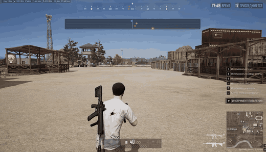
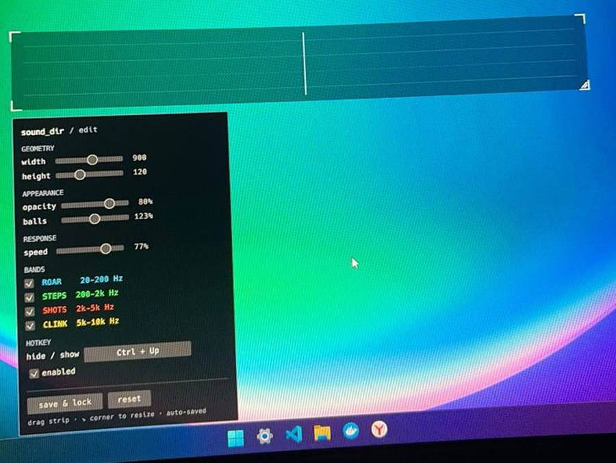

# sound_dir

Визуализация направления звука для глухих и слабослышащих игроков.
Программа слушает звук системы и показывает поверх игры полоску, на которой
цветные точки уезжают влево или вправо в зависимости от того, откуда пришел
звук.



*Полоска сверху экрана. Точка ушла вправо, значит звук справа. Цвет
показывает тип звука.*

## Зачем это сделано

Я глухой, слышу одним ухом через кохлеарный имплант. Второе не слышит
совсем.

Направление звука мозг определяет по разнице между двумя ушами: до какого
дошло раньше и до какого громче. С одним ухом этой разницы нет. Я слышу,
что выстрел был, но откуда именно, понять физически не могу.

В играх вроде PUBG это решает исход: шаги за спиной или сбоку слышно
задолго до того, как противника видно. Слуховой аппарат тут не помогает,
он делает звук громче, а не направленным.

Раз ухом это не решается, я перевел информацию в зрение. Направление стало
видно, а не слышно.

## Что показывает

Четыре полосы частот, каждая своим цветом:

| Цвет | Полоса | Частоты | Что это обычно |
|---|---|---|---|
| синий | ROAR | 20-200 Гц | техника, взрывы, гул |
| зеленый | STEPS | 200-2000 Гц | шаги, голоса |
| оранжевый | SHOTS | 2-5 кГц | выстрелы |
| желтый | CLINK | 5-10 кГц | металл, стекло, чека гранаты |



*Режим редактирования: размер полоски, прозрачность, размер точек, скорость
реакции и включение отдельных полос.*

## Как работает

1. Захват звука системы через WASAPI loopback, тем же способом, каким
   пишут OBS и Discord
2. FFT: 1024 отсчета на 48 кГц, шаг 256 отсчетов, около 190 обновлений в
   секунду
3. PCEN отдельно по каналам и частотам. Он давит постоянный фон и
   вытаскивает резкие события, поэтому гул мотора не заглушает выстрел
4. Оценка направления по каждой частоте с весом по энергии PCEN. Фон весит
   почти ноль, событие перевешивает
5. Сведение в четыре полосы и отрисовка точек в прозрачном окне поверх
   игры через egui и wgpu

Задержка от звука до движения точки около 50-80 мс. Потребление 1-3 %
процессора и примерно 50 МБ памяти.

## Про античиты

Программа не трогает игру. Она слушает тот же звук, который идет в
наушники, и рисует свое окно поверх экрана. Она **не** читает память игры,
**не** внедряет DLL и **не** перехватывает DirectX или Vulkan внутри
процесса.

С точки зрения системы это то же самое, что оверлей Discord, OBS или
NVIDIA ShadowPlay. BattlEye, EAC и Vanguard такое не трогают.

Именно поэтому подход выбран такой: любой способ, который лезет внутрь
игры, дал бы больше данных, но был бы читом и поводом для бана. Слушать
общий вывод звука это ровно та же информация, которая и так доступна
слышащему игроку в наушниках.

> [!IMPORTANT]
> Игра должна быть в оконном полноэкранном режиме (Borderless). В
> эксклюзивном полноэкранном не работает ни один оверлей, это ограничение
> Windows, а не программы.

## Установка

Готовой сборки пока нет, собирается из исходников. Нужен
[Rust](https://rustup.rs/) 1.75 или новее.

```bash
git clone https://github.com/Japour/sound_dir
cd sound_dir
cargo build --release
```

Готовый файл появится в `target/release/sound_dir.exe`.

Проверялось только на Windows 10 и 11, это основная платформа.

## Как пользоваться

1. Запустить `sound_dir.exe`
2. В трее возле часов появится иконка. В Windows 11 она может прятаться за
   стрелкой `^`, ее стоит вытащить наружу
3. Полоска появится сверху по центру экрана
4. Правый клик по иконке в трее открывает меню: режим правки, сброс
   настроек, выход

В режиме правки полоску можно двигать мышью, тянуть за угол для изменения
размера, а снизу открывается панель с ползунками. Кнопка «save & lock»
выходит из режима и сохраняет настройки в
`%APPDATA%/sound_dir/settings.json`.

## Стек

Rust, [`cpal`](https://crates.io/crates/cpal) для захвата звука,
[`realfft`](https://crates.io/crates/realfft) для преобразования Фурье,
[`eframe`](https://crates.io/crates/eframe) (egui и wgpu) для прозрачного
окна поверх игры, [`tray-icon`](https://crates.io/crates/tray-icon) для
трея, `serde` для настроек.

## Про авторство

Код на Rust писал не я. Rust я не знаю, весь код здесь написан с
ИИ-инструментами.

Мое в этом проекте другое: сама задача, выбор подхода и решения по
устройству. Что звук надо брать с системного вывода, а не из игры, иначе
это чит и бан. Что оверлей должен быть отдельным прозрачным окном без
вмешательства в процесс игры, отсюда и требование Borderless. Что
направление надо считать не по общей громкости, а отдельно по частотам с
подавлением постоянного фона, иначе гул мотора перебьет выстрел. Что полос
должно быть четыре и именно с такими границами, потому что это разные типы
звуков в игре.

Настраивал и проверял тоже я: пороги, скорость реакции, границы полос и то,
насколько это вообще читается боковым зрением в бою.

## Планы

- [ ] детекция резких событий, чтобы точки вспыхивали, а не двигались непрерывно
- [ ] несколько источников звука одновременно
- [ ] классификация звуков небольшой моделью (шаги, выстрел, техника, взрыв)
- [ ] профили под разные игры
- [ ] выбор конкретного аудиоустройства, сейчас берется вывод по умолчанию
- [ ] различение спереди и сзади, сложно, нужна работа с HRTF
- [ ] сборка под macOS и Linux

## Лицензия

[MIT](LICENSE). Берите, меняйте, используйте.

## Источники и вдохновение

- [Audio Radar](https://audioradar.com/) - коммерческое железо для глухих
  игроков, доказательство, что идея рабочая
- [Sound Visualizer в Fortnite](https://accessibility-labs.com/feature-highlight-fortnites-sound-visualizer/)
  - визуализация звука как штатная функция доступности
- Wang et al., 2017,
  [*Trainable Frontend For Robust and Far-Field Keyword Spotting*](https://arxiv.org/abs/1607.05666)
  - статья про PCEN, на котором держится «не слышать мотор, но слышать
  выстрел»

---

Если у вас похожая ситуация со слухом и эта штука пригодилась, напишите в
issues.
